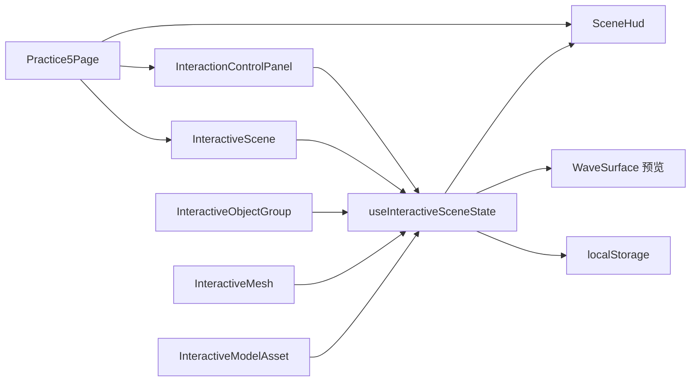

## User Requirements

### User Requirements

基于 `practice5.md` 第 882-890 行，把 Day 5 页面从当前的单对象交互实验台升级为完整的交互系统，并先输出详尽计划再实施。目标范围包含 7 项扩展能力：多对象选中系统、拖拽式移动、材质预设切换、交互事件时间轴、状态持久化、GLB 模型部位拾取提示、以及与 Day 4 Shader 参数联动。

### Product Overview

页面仍保持当前 `practice5` 的深色玻璃实验台风格，但场景内容会更丰富：场景中同时存在多个可选目标，右侧控制台随当前选中对象切换对应参数，左下 HUD 除即时状态外还展示事件时间轴与部位提示，顶部说明区同步显示当前交互模式与联动状态。整体视觉效果应比当前版本更像“可编辑的 3D 交互工作台”。

### Core Features

- 多个可选对象共存，点击任意对象后控制台切换到该对象的独立参数
- 支持基于地面平面的拖拽移动，并处理拖拽与相机控制冲突
- 为当前对象提供塑料、金属、陶瓷、发光体四种材质预设
- HUD 增加关键交互事件时间轴，只记录关键状态切换而非高频噪声
- 只持久化需要恢复的对象参数与控制台配置，刷新后可恢复编辑现场
- 将当前主目标升级为 GLB 模型，并支持点击模型不同部位显示对应提示
- 在 Day 5 控制台中加入 Shader 联动分区，让交互状态直接驱动 Shader 参数表现

## Tech Stack Selection

- 前端框架：Vue 3 + TypeScript
- 路由：Vue Router
- 3D 渲染：Three.js + `@tresjs/core` + `@tresjs/cientos`
- 现有 Day 5 页面：
- `d:/lesson_zp/threejs/practice-day1/src/pages/Practice5Page.vue`
- `d:/lesson_zp/threejs/practice-day1/src/composables/useInteractiveSceneState.ts`
- `d:/lesson_zp/threejs/practice-day1/src/components/practice5/*`
- 可复用模型资源：
- `d:/lesson_zp/threejs/practice-day1/public/models/2014_porsche_911_turbo_991.glb`
- `d:/lesson_zp/threejs/practice-day1/public/models/hatsune_miku_lbx_ver_yuki_custom__redesign.glb`
- 可复用 Shader 资产与状态参考：
- `d:/lesson_zp/threejs/practice-day1/src/components/practice4/WaveSurface.vue`
- `d:/lesson_zp/threejs/practice-day1/src/composables/useWaveShaderState.ts`

## Implementation Approach

本次采用“状态中心升级 + 场景对象拆分 + 控制台条件编辑 + HUD 扩展”的方案。核心做法是先把 Day 5 从“单个 `modelState`”升级为“对象字典 + 当前选中对象 + 部位提示 + 拖拽状态 + 时间轴 + 持久化子集”的统一状态模型，再让场景、控制台、HUD 都围绕这个状态源渲染。

关键技术决策如下：

1. **多对象状态优先于单对象补丁**

- 当前 `useInteractiveSceneState.ts` 把选中判断写死在 `hero-box`，无法支撑第 1、2、3、5、6 条需求。
- 需要升级为“每个对象一份独立 transform 和 material 参数”的结构，并用 `activeObjectId` 指向当前编辑对象。
- 这样控制台、拖拽、预设、持久化都只操作当前对象，避免状态互相覆盖。

2. **把“对象选中”和“模型部位命中”拆成两层**

- 对象层：谁是当前编辑目标，决定控制台显示谁。
- 部位层：模型内部哪一个 mesh 被点中，用于提示文案、HUD 和时间轴。
- 这样既能满足“多对象选中”，也能满足“GLB 不同部位提示”，不会把控制台错误绑定到模型子网格。

3. **拖拽采用地面平面求交，拖拽期间禁用 OrbitControls**

- 当前 Day 5 已有地面，可直接作为拖拽参照平面。
- 拖拽只在 pointer-down 到 pointer-up 区间更新当前对象位置，避免全时计算。
- 关键收尾逻辑要包含：窗口外抬起兜底、拖拽结束恢复相机控制、拖拽日志只记开始和结束。

4. **材质预设做成纯数据映射**

- 塑料、金属、陶瓷、发光体四种预设应只是一组确定的颜色、金属度、粗糙度、发光参数组合。
- 预设切换直接写回当前对象参数，不额外引入复杂状态层，便于持久化与恢复。

5. **时间轴只记录关键状态转移并限制长度**

- 记录项包括：hover-start、hover-end、select、deselect、drag-start、drag-end、preset-change、restore-from-storage、shader-toggle、part-hit。
- 不记录高频 pointer-move，否则日志会爆炸。
- 追加日志时间复杂度为 O(1)，并建议将列表长度限制在固定上限，例如 40 到 60 条。

6. **持久化只保存可恢复编辑状态**

- 应保存：对象参数、当前选中对象、预设、Shader 联动参数、是否启用自动旋转等。
- 不应保存：hover、当前拖拽状态、瞬时部位提示、完整时间轴。
- 建议在 `watch` 中只监听可持久化子集，并做轻量节流或批量序列化，避免频繁写入 `localStorage`。

7. **Shader 联动优先复用 Day 4 渲染消费层，不直接耦合 Day 4 页面状态**

- 推荐在 Day 5 里复用 `WaveSurface.vue` 的渲染链路与 `wavePresetDefinitions` 数据，而不是直接把 Day 4 整页控制台搬过来。
- 这样可以让 Day 5 控制台驱动 Shader 预览，同时避免 Practice4 和 Practice5 因共享全局状态而互相污染。
- 如执行中验证发现 `WaveSurface.vue` 当前 props 不足，再最小化扩展其输入接口。

### Performance and Reliability

- **多对象状态读取**：按对象 id 访问，单次读取和更新为 O(1)
- **GLB 部件索引构建**：模型加载完成后遍历一次 mesh 树，复杂度 O(n)，仅初始化时发生
- **拖拽更新**：仅拖拽期间执行平面求交与位置更新，单帧 O(1)
- **时间轴维护**：尾部追加 O(1)，通过固定长度裁剪避免内存增长
- **持久化写入**：对可恢复子集做聚合写入，避免每个字段单独监听造成 I/O 放大

## Implementation Notes

- `Practice5Page.vue` 当前在 mounted 时直接调用 `resetInteractiveSceneState()`，扩展后必须改成“先尝试恢复，再按需重置”，否则存档会被页面进入逻辑清空。
- `InteractiveMesh.vue` 当前只适合单立方体，实施时应把它改成可复用的“单个可交互 primitive 渲染器”或拆分为对象组，避免把三对象逻辑继续硬塞进一个组件。
- GLB 交互建议优先复用 `practice2/ModelViewer.vue` 的 `useGLTF` 加载方式和模型遍历模式，只把动画相关逻辑剥离掉。
- 若要把 Shader 联动放进 Day 5，先复用 `practice4/WaveSurface.vue`，避免复制整套 shader factory 和 uniform 同步逻辑。
- 保持 Day 1 到 Day 4 页面无行为变化；如必须抽公共工具，只抽纯函数或纯数据，不回改无关页面业务。
- 日志与持久化都不要输出过大 payload，避免控制台噪音与存储浪费。

## Architecture Design

### System Structure

### Module Division

- **状态层**
- 升级 `useInteractiveSceneState.ts`
- 统一管理对象参数、选中对象、部位提示、拖拽状态、时间轴、持久化快照、Shader 联动参数
- **场景层**
- `InteractiveScene.vue` 负责舞台、灯光、地面、Shader 预览面
- 对象组组件负责多目标渲染和拖拽交互
- GLB 组件负责模型加载、部件命中提示、材质与 transform 同步
- **面板层**
- `InteractionControlPanel.vue` 根据当前选中对象动态显示 transform、材质、预设、持久化、Shader 分区
- **反馈层**
- `SceneHud.vue` 展示 hovered、selected、part hint、timeline、restore 状态、Shader 联动状态
- **文档层**
- `practice5.md` 补充新的验证清单和交互验收步骤

### Data Flow

- 控制台修改对象参数 → 状态层更新 → 场景对象与 Shader props 同步刷新
- 场景 hover / click / drag / part hit → 状态层更新 → HUD 与顶部说明区同步变化
- 持久化快照变化 → 写入 `localStorage`
- 首次进入页面 → 读取 `localStorage` → 恢复对象参数与控制台状态

## Directory Structure

### Directory Structure Summary

本次改动集中在 Day 5，不改动既有 Day 1-4 业务逻辑。核心是扩展 Day 5 的状态模型、场景对象组织、控制台结构和 HUD 信息层。

d:/lesson_zp/threejs/practice-day1/src/

- `pages/Practice5Page.vue` `[MODIFY]`
- Purpose：Day 5 页面入口
- Functionality：调整初始化流程，从“进入即重置”改为“恢复优先，显式重置兜底”，并接入新增场景对象与扩展 HUD
- Implementation requirements：避免首次 mounted 直接覆盖本地存档

- `composables/useInteractiveSceneState.ts` `[MODIFY]`
- Purpose：Day 5 的统一状态中心
- Functionality：把单对象状态升级为多对象参数表、当前对象引用、部位提示、拖拽状态、材质预设、时间轴、持久化快照、Shader 联动参数
- Implementation requirements：保持 API 清晰，尽量用纯函数处理预设应用、日志追加和快照序列化

- `components/practice5/InteractiveScene.vue` `[MODIFY]`
- Purpose：场景舞台壳层
- Functionality：装配多对象组、GLB 模型对象、地面拖拽参照、Shader 联动预览、顶部说明卡
- Implementation requirements：控制左上说明区与右侧控制台宽度关系，避免窄屏遮挡

- `components/practice5/InteractiveMesh.vue` `[MODIFY]`
- Purpose：可复用 primitive 交互对象
- Functionality：从当前单立方体改造成可配置的单对象渲染器，支持不同几何体、选中高亮、自动旋转与拖拽态
- Implementation requirements：不再把逻辑写死在 `hero-box`

- `components/practice5/InteractionControlPanel.vue` `[MODIFY]`
- Purpose：右侧控制台
- Functionality：按当前选中对象显示独立参数，并新增材质预设、持久化操作、Shader 联动分区
- Implementation requirements：面板长度变长后要保证分区清晰、滚动可用、条件渲染合理

- `components/practice5/SceneHud.vue` `[MODIFY]`
- Purpose：左下 HUD
- Functionality：在现有状态卡基础上增加部位提示、交互时间轴、恢复状态提示、Shader 联动摘要
- Implementation requirements：时间轴列表要有长度上限和滚动区，避免遮挡主场景

- `components/practice5/InteractiveObjectGroup.vue` `[NEW]`
- Purpose：多对象交互编排层
- Functionality：统一管理三个可选目标的渲染、事件绑定、拖拽启停和当前对象切换
- Implementation requirements：优先把对象列表数据化，减少重复模板

- `components/practice5/InteractiveModelAsset.vue` `[NEW]`
- Purpose：GLB 模型目标组件
- Functionality：复用现有 `useGLTF` 模式加载 GLB，提取可点击 mesh，回传部位提示，并同步选中对象参数
- Implementation requirements：加载后一次性遍历节点并缓存部件映射，避免每次点击重复遍历

- `docs/practice5.md` `[MODIFY]`
- Purpose：Day 5 文档验收与扩展记录
- Functionality：把新增 7 项功能补充成可操作的验证清单
- Implementation requirements：验证项需与最终页面真实行为逐项对应

### Reuse Without Preferred Modification

- `d:/lesson_zp/threejs/practice-day1/src/components/practice4/WaveSurface.vue`
- `d:/lesson_zp/threejs/practice-day1/src/composables/useWaveShaderState.ts`
- `d:/lesson_zp/threejs/practice-day1/src/components/practice2/ModelViewer.vue`

优先复用这些已有实现作为 Day 5 的 Shader、GLB 加载和参数参考；只有在执行中验证出现明确接口不足时，才做最小范围调整。

## Key Execution Details

- 多对象建议采用“对象字典 + 当前对象 id”的组织方式，而不是多个独立 `ref`
- 模型部件提示建议单独维护 `activePartLabel`，不要复用 `selectedObject`
- 拖拽建议记录 `draggingObjectId`、拖拽起点、地面平面与相机控制器锁定状态
- 持久化快照建议包含版本号，便于后续结构升级时安全回退

## 设计方向

保持当前 Practice5 的深色玻璃实验台风格，并把新增复杂功能收束成“一个主舞台 + 一个主控制台 + 一个增强 HUD”的结构，而不是让界面被新功能切碎。整体视觉应更像专业 3D 编辑工作台：信息密度更高，但层级更清晰。

## 页面块规划

- **顶部全局导航**：继续沿用现有 Day1-5 顶部导航，不新增底部导航，这是全屏 3D 工作台的特殊场景。
- **左上说明卡**：显示当前选中对象、模型部位提示、拖拽状态、Shader 联动状态。
- **中央 3D 舞台**：同时容纳三个可选目标、地面拖拽参照、GLB 模型主体和可选 Shader 联动预览面。
- **右侧控制台**：按对象切换参数分区，新增材质预设、状态恢复、Shader 联动分区，滚动区更长但仍保持卡片节奏。
- **左下 HUD**：保留状态卡，再新增时间轴列表和部位提示卡，列表区可滚动且不压缩主状态信息。

## 交互视觉

- 当前选中对象应有明显高亮和标签反馈，未选中对象保留较弱 hover 发光
- 拖拽开始与结束需要明确状态提示，避免用户误以为 OrbitControls 失效
- 时间轴应采用弱对比列表样式，强调最新事件但不喧宾夺主
- Shader 联动区应做折叠或次级卡片处理，避免右侧控制台第一屏过度拥挤

## Agent Extensions

- **code-explorer**
- Purpose: 复核 Day 5 现有文件、模型资源、Shader 复用边界与受影响链路
- Expected outcome: 得到可靠的文件级改动范围，避免遗漏 `practice5` 场景、状态和 HUD 之间的依赖

- **frontend-design**
- Purpose: 在不破坏现有风格的前提下扩展控制台、HUD 和说明卡的复杂信息层级
- Expected outcome: 新增对象编辑区、时间轴和 Shader 联动区后，页面仍保持统一且清晰的视觉节奏

- **Context7**
- Purpose: 在实施前核对 TresJS 与 Three.js 当前版本下的拖拽、指针事件、GLB 加载与相机控制相关文档
- Expected outcome: 避免再次出现 API 版本差异导致的实现偏差，确保拖拽和模型拾取方案可落地