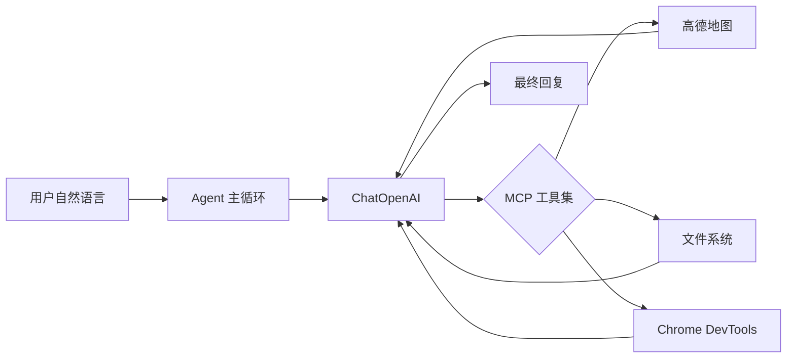

# mcp-test 项目 README 计划

## 项目概要

该项目是一个 **MCP (Model Context Protocol) Agent 示例**，结合 LangChain、多种 MCP 工具与 LLM，实现多工具协同的智能 Agent。AI 可根据用户自然语言请求，自动调用高德地图、文件系统、Chrome DevTools 等工具完成任务。

## README 结构规划

### 1. 项目简介

- 一句话说明：基于 LangChain + MCP 的多工具 Agent 示例
- 核心能力：POI 搜索/路线规划、本地文件读写、浏览器控制

### 2. 技术栈

| 类别     | 依赖                                                              |
| -------- | ----------------------------------------------------------------- |
| 框架     | `@langchain/core`、`@langchain/mcp-adapters`、`@langchain/openai` |
| MCP 服务 | 高德地图、MCP 文件系统、Chrome DevTools                           |
| 辅助     | `chalk`、`dotenv`                                                 |

### 3. 架构说明



核心流程（[main.mjs](ai/agent/mini-cursor/mcp_in_action/mcp-test/main.mjs)）：

- 用户提问 → LLM 思考 → 可选调用工具 → 工具结果反馈 LLM → 循环直到给出最终答案

### 4. 环境配置

- 复制 `.env.example` 为 `.env`
- 必填：`OPENAI_API_KEY`、`MODEL_NAME`、`OPENAI_BASE_URL`（国内代理）
- 高德相关：`AMAP_MAPS_API_KEY`（POI/路线功能需此项）

### 5. 安装与运行

```bash
pnpm install
# 配置 .env 后
pnpm start
```

### 6. 使用示例

引用 [main.mjs](ai/agent/mini-cursor/mcp_in_action/mcp-test/main.mjs) 中的示例：

- 简单查询：`北京南站附近的酒店，以及去的路线`
- 生成文档：`永丰县附近的3个酒店... 整理成 Markdown 保存为 yongfeng_county_hotels.md`
- 浏览器展示：`永丰县附近的3个酒店，拿到酒店图片，展开浏览器展示...`

### 7. 项目文件说明

- `main.mjs`：Agent 入口与主循环
- `yongfeng_county_hotels.md` / `beijing_south_station_hotels.md`：运行生成的示例输出

### 8. 注意事项

- 使用 Chrome DevTools MCP 前需确保 Chrome 已运行且开启远程调试
- 文件系统 MCP 仅能访问项目目录（`__dirname`）

## 实施方式

在 [ai/agent/mini-cursor/mcp_in_action/mcp-test/README.md](ai/agent/mini-cursor/mcp_in_action/mcp-test/README.md) 新建文件，按上述结构编写 Markdown，保持与 `CLAUDE.md` 语言规范一致（简体中文）。
