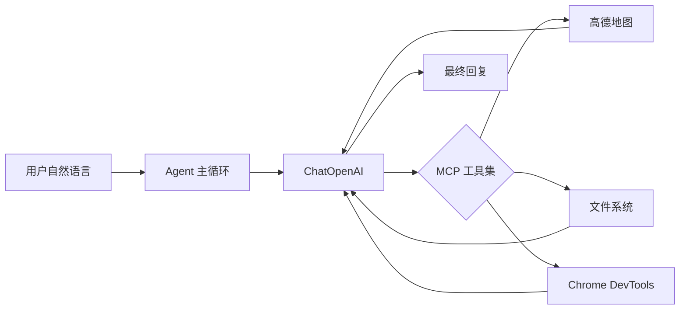

# mcp-test

基于 LangChain + MCP 的多工具 Agent 示例，结合 LLM 与多种 MCP 工具，实现智能任务编排。

## 核心能力

- **POI 搜索 / 路线规划**：通过高德地图 MCP 查询地点、规划步行/驾车路线
- **本地文件读写**：通过 MCP 文件系统生成并保存 Markdown 文档
- **浏览器控制**：通过 Chrome DevTools MCP 打开页面、截图、修改标题等

## 技术栈

| 类别     | 依赖                                                                 |
| -------- | -------------------------------------------------------------------- |
| 框架     | `@langchain/core`、`@langchain/mcp-adapters`、`@langchain/openai`    |
| MCP 服务 | 高德地图、MCP 文件系统、Chrome DevTools                              |
| 辅助     | `chalk`、`dotenv`                                                    |

## 架构说明



核心流程（[main.mjs](main.mjs)）：

1. 用户提问 → LLM 思考
2. 若需调用工具 → 并行执行工具 → 将结果反馈给 LLM
3. 循环直到 LLM 给出最终答案（不再发起工具调用）

## 环境配置

1. 复制 `.env.example` 为 `.env`
2. 配置 LLM 相关变量：
   - `OPENAI_API_KEY`（必填）
   - `MODEL_NAME`（必填，如 `qwen-plus`）
   - `OPENAI_BASE_URL`（可选，用于对接国内 API 代理）
3. 高德地图（POI/路线功能需此项）：
   - `AMAP_MAPS_API_KEY`

## 安装与运行

```bash
pnpm install
# 配置 .env 后
pnpm start
```

## 使用示例

修改 [main.mjs](main.mjs) 中 `runAgentWithTools` 的调用参数，可尝试以下示例：

**简单查询：**
```javascript
await runAgentWithTools('北京南站附近的酒店，以及去的路线');
```

**生成文档：**
```javascript
await runAgentWithTools(`
永丰县附近的3个酒店，获取每个酒店的地址、评分、距离，以及从永丰县到每个酒店的步行/驾车路线，
整理成 Markdown 文档，保存为 yongfeng_county_hotels.md
`);
```

**浏览器展示：**
```javascript
await runAgentWithTools(`
永丰县附近的3个酒店，拿到酒店图片，展开浏览器，展示每个酒店的图片，
每个 tab 一个 url 展示，并且把那个页面标题改为酒店名
`);
```

## 项目文件说明

| 文件 | 说明 |
| ---- | ---- |
| `main.mjs` | Agent 入口与主循环逻辑 |
| `yongfeng_county_hotels.md` | 永丰县附近酒店示例输出（运行生成） |
| `beijing_south_station_hotels.md` | 北京南站附近酒店示例输出（运行生成） |

## 注意事项

- 使用 Chrome DevTools MCP 前需确保 Chrome 已运行且开启远程调试
- 文件系统 MCP 仅能访问项目目录（`__dirname`）
